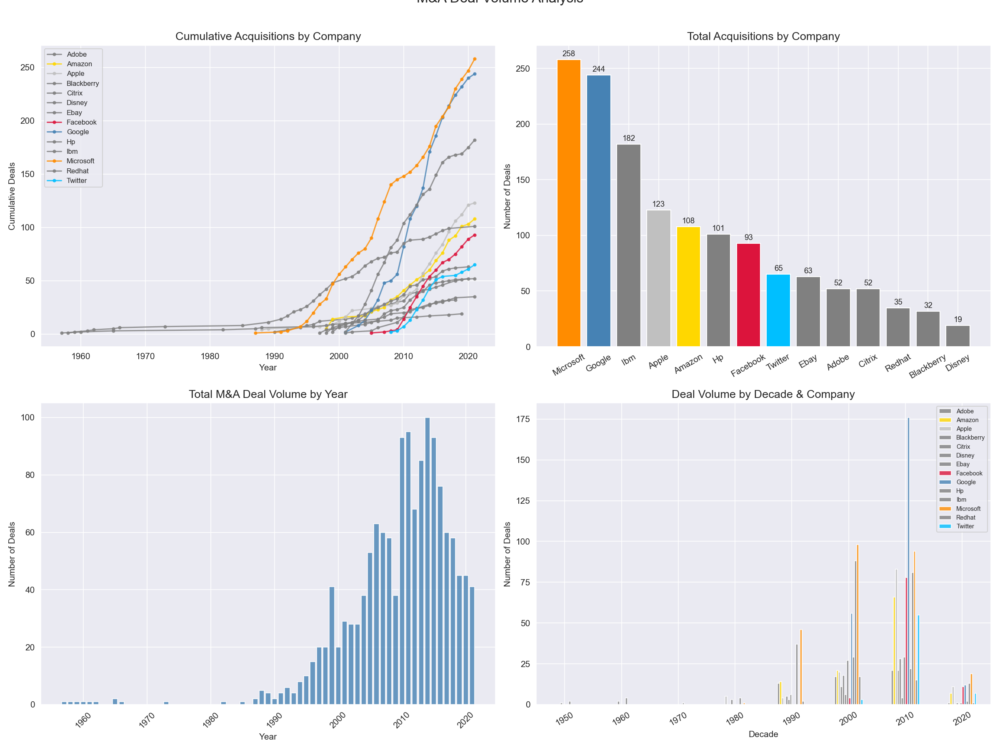
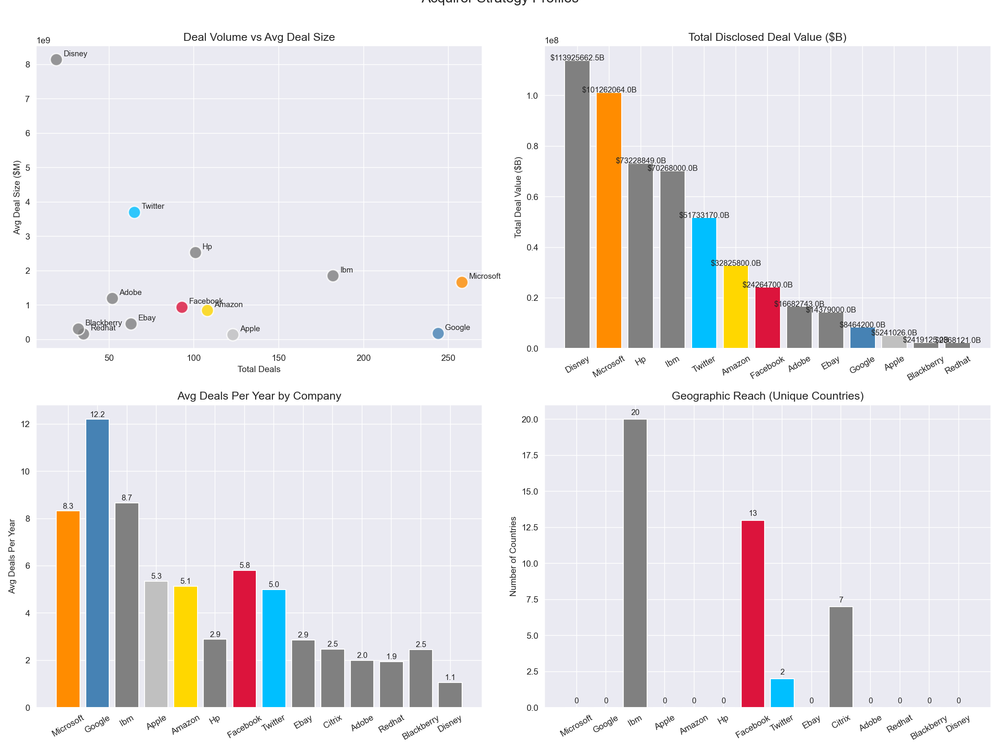
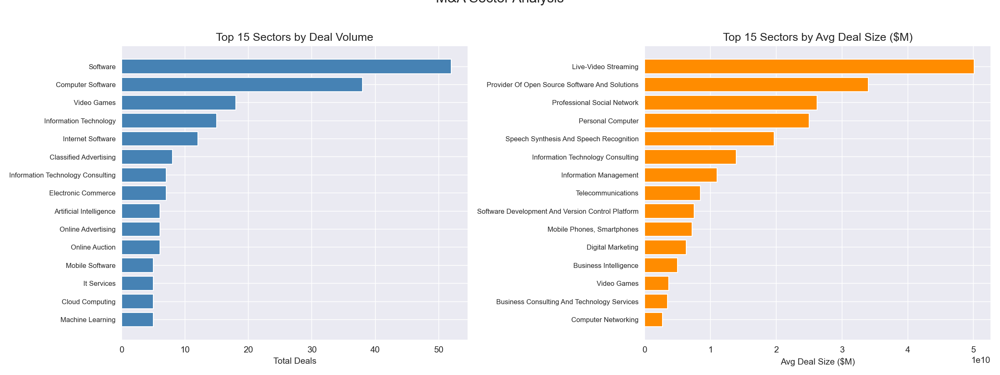
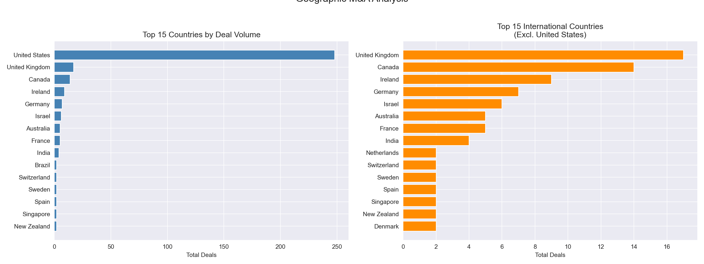
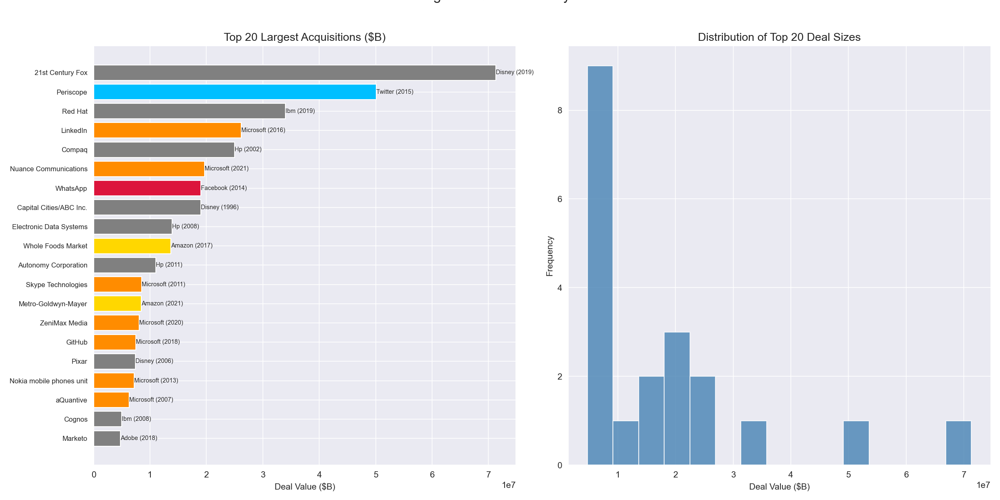
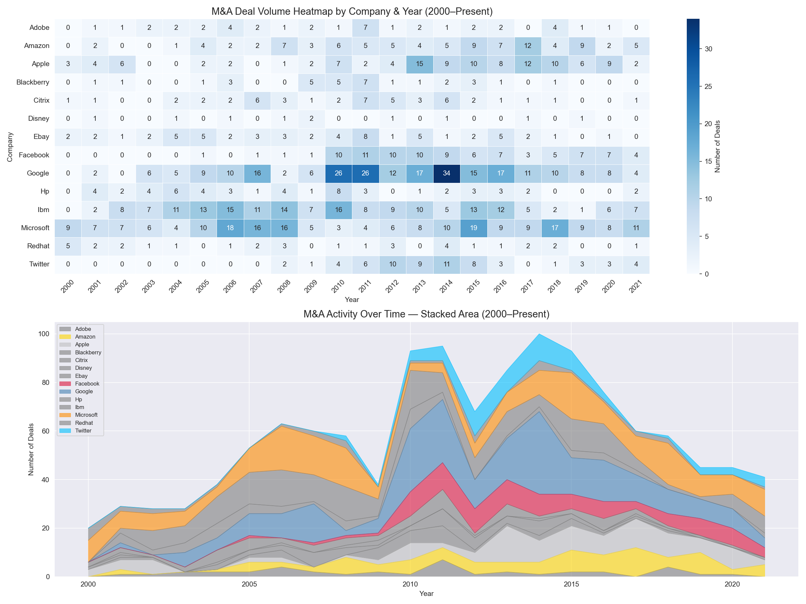

# Mergers & Acquisitions Analysis — Deal Volume, Valuation & Sector Trends

A SQL and Python analysis of 1,455 acquisitions by 14 major technology companies spanning 1957–2021, examining deal volume trends, acquirer strategy profiles, sector focus, geographic reach, and the largest disclosed transactions in tech M&A history.

---

## Problem Statement
Mergers and acquisitions are the primary mechanism through which technology companies expand capabilities, enter new markets, and eliminate competition. This project analyzes M&A patterns across major tech acquirers to answer:
- Which companies are the most active acquirers by volume and value?
- How has M&A activity evolved over time and across decades?
- Which sectors attract the most deal activity and highest valuations?
- What do acquisition patterns reveal about each company's strategy?
- Which deals represent the largest disclosed valuations in tech history?

---

## Dataset
- **Source:** [Kaggle — Company Acquisitions Dataset](https://www.kaggle.com/datasets/shivamb/company-acquisitions-7-top-companies)
- **Size:** 1,455 deals across 14 acquirers
- **Period:** 1957 – 2021
- **Deals with Disclosed Price:** 383 (26.3%)
- **Database:** PostgreSQL (local)

---

## Acquirers Covered
Microsoft, Google, IBM, HP, Apple, Amazon, Facebook, Twitter, eBay, Adobe, Citrix, Red Hat, BlackBerry, Disney

---

## Tools & Libraries
- PostgreSQL, pgAdmin
- Python 3.x
- Pandas, NumPy
- Matplotlib, Seaborn
- SQLAlchemy, psycopg2

---

## Project Workflow
1. Data ingestion — loaded CSV into PostgreSQL via Python, cleaned price fields (removed $, B, M notation, converted to numeric millions), replaced placeholder missing values ("-"), engineered decade column
2. SQL analysis — deal volume with YoY growth using LAG, sector analysis with Window Function ranking, acquirer strategy profiles, deal-level ranking with cumulative spend
3. Python visualization — cumulative deal trajectories, acquirer strategy scatter, sector analysis, geographic reach, largest deals, activity heatmap and timeline
4. Business insight communication — translated acquisition patterns into corporate strategy narratives for each major acquirer

---

## SQL Techniques Demonstrated
- Common Table Expressions (CTEs)
- Window Functions (RANK, NTILE, LAG for YoY growth, cumulative SUM OVER PARTITION BY, AVG OVER PARTITION BY for peer comparison)
- COALESCE for normalizing inconsistent category and business fields
- NULLS LAST for ranking with missing values
- Multi-dimensional GROUP BY across company, year, sector, and country

---

## Key Findings
- **Disney generated $113.9B in total deal value from just 19 acquisitions** ($8.14B avg) — the highest total of any acquirer, driven by the $71.3B 21st Century Fox deal, demonstrating the transformative vs high-frequency strategy
- **Google averaged 12.20 deals per year** — the ighest cadence — at $172.7M avg deal size, reflecting systematic acqui-hire and early stage technology absorption aligned with defending advertising dominance
- **2014 was the peak M&A year at 100 deals** — coinciding with the mobile computing and cloud infrastructure acquisition wave as companies raced to compete in the post-PC era
- **Microsoft's $26.2B LinkedIn acquisition (2016)** stands as its most strategically significant deal, providing the professional network layer underpinning Microsoft 365 and Azure
- **Apple made the smallest average deals ($134.4M)** among major acquirers despite being the world's most valuable company — acquiring specific technical capabilities rather than businesses
- **Twitter's $3.70B average deal size is a data anomaly** — the $50.1B Periscope value is almost certainly a data entry error (~$100M reported), highlighting M&A price data validation challenges
- **72.7% of geo-tagged deals target U.S. companies** — UK (17), Canada (14), and Israel (6) lead international targets, with Israel showing disproportionate activity in cybersecurity
- **Only 26.3% of deals have disclosed prices** — true total M&A spend significantly exceeds disclosed figures for all acquirers

---

## Visualizations

### Deal Volume Analysis

### Acquirer Strategy Profiles

### Sector Analysis

### Geographic Analysis

### Largest Deals

### Deal Activity Timeline & Heatmap

---

## SQL Query Files
All queries are saved in the `sql/` folder:
- `01_create_table.sql` — schema creation
- `02_deal_volume.sql` — annual deal volume with YoY growth using LAG Window Function
- `03_sector_analysis.sql` — sector deal volume and value ranking with PARTITION BY
- `04_acquirer_analysis.sql` — acquirer strategy profile with pace, scale, and geographic reach metrics
- `05_window_functions.sql` — deal-level ranking with RANK, NTILE, cumulative spend, and vs-company-average comparison

---

## Limitations & Next Steps
- Only covers 14 major tech companies — not a representative broad M&A market sample
- 73.7% of deals have undisclosed prices — valuation analysis covers only disclosed larger transactions
- Twitter/Periscope price anomaly ($50.1B) requires validation — likely data error
- Geographic data missing for majority of deals
- Future work: deal outcome analysis, deal size prediction model, acquisition premium multiples, broader market API integration

---

## How to Run This Project
1. Clone the repository
2. Install PostgreSQL and pgAdmin from [postgresql.org](https://postgresql.org)
3. Create a database called `ma_analysis` in pgAdmin
4. Download `acquisitions.csv` from [Kaggle](https://www.kaggle.com/datasets/shivamb/company-acquisitions-7-top-companies) and place it in the project root folder
5. Install Python dependencies: `pip install pandas numpy matplotlib seaborn sqlalchemy psycopg2-binary`
6. Open `ma_analysis.ipynb` in Jupyter or VS Code
7. Update the database connection string with your PostgreSQL password
8. Run all cells — data loads automatically into PostgreSQL and all analysis runs end to end

---

## Repository Structure

---

## Author
**Mihrimah Qozat**
[LinkedIn](https://linkedin.com/in/mihrimah-qozat) |
[GitHub](https://github.com/mihrimahqozat)
